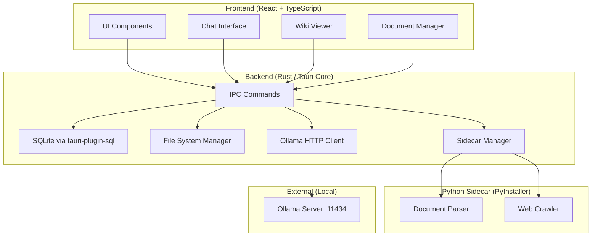

# KnowledgeForge — Implementation Plan

> Desktop app: Upload tài liệu → Build knowledge (LLM-Wiki) → Chat & So sánh
> Stack: Tauri 2.0 + React + TypeScript + Python Sidecar + Ollama + SQLite

---

## 1. Tổng quan Kiến trúc



### Data Flow: Upload → Knowledge → Chat

```
1. User uploads PDF/DOCX/URL
2. Rust → Python Sidecar: parse to Markdown
3. Rust saves to raw/articles/ (immutable)
4. Rust → Ollama: extract entities, concepts, summary
5. Rust saves wiki pages to wiki/sources/, wiki/entities/, wiki/concepts/
6. User chats → Rust reads relevant wiki pages → builds prompt → Ollama → response
```

---

## 2. Tech Stack

| Layer | Technology | Lý do |
|-------|-----------|-------|
| Desktop Framework | Tauri 2.0 | Nhẹ (~5MB), bảo mật, cross-platform |
| Frontend | React 18 + TypeScript + Vite | Ecosystem lớn, type-safe |
| Styling | CSS Modules + Vanilla CSS | Không dependency thừa |
| State Management | Zustand | Nhẹ, immutable-friendly |
| Backend | Rust (Tauri Core) | Performance, security |
| Database | SQLite via `tauri-plugin-sql` | Embedded, no server |
| LLM | Ollama (local) | Privacy, miễn phí |
| Document Parsing | Python (PyInstaller sidecar) | Ecosystem mạnh cho PDF/crawl |
| Markdown Render | `react-markdown` + `remark-gfm` | Render wiki pages |
| Icons | `lucide-react` | Lightweight, consistent |

---

## 3. Cấu trúc Thư mục

```
knowledge-forge/
├── src/                          # React Frontend
│   ├── App.tsx
│   ├── main.tsx
│   ├── index.css                 # Design tokens
│   ├── components/
│   │   ├── layout/               # Shell, Sidebar, Header
│   │   ├── documents/            # Upload, DocumentList, DocumentCard
│   │   ├── wiki/                 # WikiViewer, WikiIndex, WikiPage
│   │   ├── chat/                 # ChatPanel, MessageBubble, ChatInput
│   │   └── common/               # Button, Modal, ProgressBar, Toast
│   ├── hooks/
│   │   ├── useDocuments.ts       # Document CRUD operations
│   │   ├── useWiki.ts            # Wiki page read/search
│   │   ├── useChat.ts            # Chat with Ollama
│   │   ├── useIngest.ts          # Ingest pipeline control
│   │   └── useOllamaStatus.ts    # Health check & model management
│   ├── services/
│   │   ├── ipc.ts                # Typed invoke() wrappers
│   │   └── constants.ts          # App-wide constants
│   ├── stores/
│   │   └── appStore.ts           # Zustand global state
│   └── types/
│       ├── document.ts
│       ├── wiki.ts
│       ├── chat.ts
│       └── ipc.ts                # IPC request/response types
│
├── src-tauri/                    # Rust Backend
│   ├── Cargo.toml
│   ├── tauri.conf.json
│   ├── capabilities/
│   │   └── default.json          # Minimal permissions
│   ├── src/
│   │   ├── main.rs               # Entry point
│   │   ├── lib.rs                # Module declarations
│   │   ├── commands/             # IPC command handlers
│   │   │   ├── mod.rs
│   │   │   ├── documents.rs      # Upload, list, delete
│   │   │   ├── wiki.rs           # Read wiki pages, search
│   │   │   ├── chat.rs           # Send message, get history
│   │   │   ├── ingest.rs         # Trigger ingest pipeline
│   │   │   ├── ollama.rs         # Health, pull model, generate
│   │   │   └── sidecar.rs        # Python sidecar control
│   │   ├── services/
│   │   │   ├── mod.rs
│   │   │   ├── ollama_client.rs  # HTTP client for Ollama API
│   │   │   ├── wiki_engine.rs    # Read/write/search wiki .md files
│   │   │   ├── ingest_engine.rs  # Orchestrate full ingest pipeline
│   │   │   └── db.rs             # SQLite helpers
│   │   ├── models/               # Shared structs
│   │   │   ├── mod.rs
│   │   │   ├── document.rs
│   │   │   └── chat.rs
│   │   └── errors.rs             # AppError enum
│   └── binaries/                 # Python sidecar executables
│       └── parser-x86_64-pc-windows-msvc.exe
│
├── python_engine/                # Python Sidecar Source
│   ├── requirements.txt
│   ├── parser.py                 # CLI entry point
│   ├── parsers/
│   │   ├── pdf_parser.py         # pdfplumber / PyMuPDF
│   │   ├── docx_parser.py        # python-docx
│   │   ├── web_crawler.py        # requests + BeautifulSoup
│   │   └── markdown_converter.py # Unified output
│   ├── tests/
│   └── build.py                  # PyInstaller build script
│
├── data/                         # LLM-Wiki data (at runtime: $APPDATA)
│   ├── raw/                      # Immutable sources
│   │   ├── articles/
│   │   ├── papers/
│   │   └── notes/
│   ├── wiki/                     # LLM-generated knowledge
│   │   ├── INDEX.md
│   │   ├── LOG.md
│   │   ├── entities/
│   │   ├── concepts/
│   │   ├── sources/
│   │   └── syntheses/
│   ├── outputs/
│   └── .discoveries/
│       └── history.json
│
├── docs/                         # Developer documentation
│   ├── ARCHITECTURE.md
│   ├── IPC_COMMANDS.md
│   ├── PYTHON_SIDECAR.md
│   ├── DATABASE_SCHEMA.md
│   └── DEPLOYMENT.md
│
├── package.json
├── tsconfig.json
├── vite.config.ts
└── README.md
```

---

## 4. Database Schema (SQLite)

```sql
-- Documents metadata (files tracked by the system)
CREATE TABLE documents (
    id TEXT PRIMARY KEY DEFAULT (lower(hex(randomblob(16)))),
    title TEXT NOT NULL,
    original_filename TEXT NOT NULL,
    raw_path TEXT NOT NULL,          -- relative path in raw/
    wiki_source_path TEXT,           -- relative path in wiki/sources/
    file_type TEXT NOT NULL,         -- 'pdf' | 'docx' | 'url' | 'md' | 'txt'
    file_size_bytes INTEGER,
    status TEXT NOT NULL DEFAULT 'pending',  -- 'pending'|'parsing'|'ingesting'|'ready'|'error'
    error_message TEXT,
    created_at TEXT NOT NULL DEFAULT (datetime('now')),
    updated_at TEXT NOT NULL DEFAULT (datetime('now'))
);

-- Chat conversations
CREATE TABLE conversations (
    id TEXT PRIMARY KEY DEFAULT (lower(hex(randomblob(16)))),
    title TEXT NOT NULL,
    mode TEXT NOT NULL DEFAULT 'general',  -- 'general'|'document'|'compare'|'quiz'
    context_doc_ids TEXT,            -- JSON array of document IDs
    created_at TEXT NOT NULL DEFAULT (datetime('now')),
    updated_at TEXT NOT NULL DEFAULT (datetime('now'))
);

-- Chat messages
CREATE TABLE messages (
    id TEXT PRIMARY KEY DEFAULT (lower(hex(randomblob(16)))),
    conversation_id TEXT NOT NULL REFERENCES conversations(id),
    role TEXT NOT NULL,               -- 'user' | 'assistant' | 'system'
    content TEXT NOT NULL,
    wiki_pages_used TEXT,             -- JSON array of wiki page paths used as context
    created_at TEXT NOT NULL DEFAULT (datetime('now'))
);

-- App settings
CREATE TABLE settings (
    key TEXT PRIMARY KEY,
    value TEXT NOT NULL,
    updated_at TEXT NOT NULL DEFAULT (datetime('now'))
);

-- Indexes
CREATE INDEX idx_documents_status ON documents(status);
CREATE INDEX idx_messages_conversation ON messages(conversation_id);
CREATE INDEX idx_conversations_mode ON conversations(mode);
```

---

## 5. IPC Commands (Rust ↔ React)

### Document Commands

| Command | Input | Output | Mô tả |
|---------|-------|--------|--------|
| `upload_document` | `{file_path, file_type}` | `Document` | Copy file → raw/, insert DB |
| `upload_url` | `{url}` | `Document` | Crawl URL via sidecar → raw/ |
| `list_documents` | `{status?, limit?, offset?}` | `Document[]` | Paginated list |
| `get_document` | `{id}` | `Document` | Single document |
| `delete_document` | `{id}` | `void` | Remove from DB (raw kept) |

### Ingest Commands

| Command | Input | Output | Mô tả |
|---------|-------|--------|--------|
| `parse_document` | `{document_id}` | `{markdown}` | Python sidecar → MD |
| `ingest_document` | `{document_id}` | `IngestResult` | Full pipeline: parse → LLM extract → wiki |
| `ingest_all_pending` | `void` | `IngestResult[]` | Batch ingest |

### Wiki Commands

| Command | Input | Output | Mô tả |
|---------|-------|--------|--------|
| `get_wiki_index` | `void` | `WikiIndex` | Read INDEX.md |
| `get_wiki_page` | `{path}` | `WikiPage` | Read single page |
| `search_wiki` | `{query}` | `WikiPage[]` | Full-text search wiki/ |

### Chat Commands

| Command | Input | Output | Mô tả |
|---------|-------|--------|--------|
| `send_message` | `{conversation_id, content, mode}` | `Message` | Chat with context |
| `compare_documents` | `{doc_ids: [id1, id2]}` | `Message` | So sánh 2 docs |
| `generate_quiz` | `{doc_id, count}` | `Quiz` | Tạo quiz từ tài liệu |
| `list_conversations` | `void` | `Conversation[]` | All chats |
| `get_conversation` | `{id}` | `{conv, messages[]}` | Full chat history |

### System Commands

| Command | Input | Output | Mô tả |
|---------|-------|--------|--------|
| `check_ollama` | `void` | `{ok, models[]}` | Health check |
| `pull_model` | `{model_name}` | Stream events | Download model |
| `get_settings` | `void` | `Settings` | App config |
| `update_settings` | `{key, value}` | `void` | Save config |

---

## 6. Các Giai đoạn Triển khai

### Phase 1: Foundation (Tuần 1-2)

**Mục tiêu:** Skeleton chạy được, build ra `.exe`

- [x] `npm create tauri-app@latest ./` (React, TypeScript, Vite)
- [x] Setup SQLite plugin, tạo migration schema
- [x] Cấu hình `capabilities/default.json` (minimal permissions)
- [x] Cấu hình CSP trong `tauri.conf.json`
- [x] Tạo layout shell: Sidebar + Main Content
- [x] Tạo design tokens (CSS variables, typography)
- [x] Tạo thư mục `data/` structure (raw/, wiki/, outputs/)
- [x] IPC: `check_ollama`, `get_settings`
- [x] Màn hình Onboarding (check Ollama, pull model)
- [x] `cargo test` + `npm test` pipeline

**Deliverable:** App mở được, check Ollama status, UI skeleton

### Phase 2: Document Upload + Parse (Tuần 3-4)

**Mục tiêu:** Upload file → parse thành Markdown

- [x] Python sidecar: `parser.py` CLI (`--input <path> --type pdf|docx|url --output <path>`)
- [x] Parsers: `pdf_parser.py` (pdfplumber), `docx_parser.py`, `web_crawler.py`
- [x] PyInstaller build: `pyinstaller --onefile parser.py` (via `build.py`)
- [x] Rust sidecar integration: `Command::new_sidecar("parser")`
- [x] IPC: `upload_document`, `parse_document`, `list_documents`
- [x] React: Upload dropzone, document list, parse progress
- [x] Custom hook: `useDocuments()`, `useIngest()`

**Deliverable:** Upload PDF/DOCX/URL → xem Markdown preview

### Phase 3: Knowledge Building — Ingest (Tuần 5-6)

**Mục tiêu:** Markdown → Wiki pages (theo LLM-Wiki pattern)

- [x] `ollama_client.rs`: POST `/api/generate` với structured prompts
- [x] `ingest_engine.rs`: orchestrate pipeline
  1. Đọc raw markdown
  2. Gửi prompt "Extract entities, concepts, summary" → Ollama
  3. Parse JSON response
  4. Tạo file wiki/sources/, wiki/entities/, wiki/concepts/
  5. Cập nhật INDEX.md, LOG.md
  6. Update document status → 'ready'
- [x] IPC: `ingest_document`, `ingest_all_pending`
- [x] React: Ingest progress UI, wiki index viewer
- [x] `wiki_engine.rs`: read/search markdown files

**Deliverable:** Upload → auto-build wiki → browse wiki pages

### Phase 4: Chat Layer (Tuần 7-8)

**Mục tiêu:** Chat dựa trên wiki, so sánh, quiz

- [x] Chat logic trong `commands/chat.rs`:
  1. Nhận message + mode (general/document/compare/quiz)
  2. Tìm wiki pages liên quan (search INDEX.md + full-text)
  3. Build system prompt với wiki context
  4. POST Ollama `/api/chat` (streaming)
  5. Save message to DB
- [x] Streaming response: Tauri events → React
- [x] Compare mode: load 2 docs' wiki pages → prompt "so sánh"
- [x] Quiz mode: prompt "tạo N câu trắc nghiệm JSON" → render UI
- [x] React: `ChatPanel`, `MessageBubble`, `ChatInput`, `QuizCard`
- [x] Custom hook: `useChat()`

**Deliverable:** Chat trong context tài liệu, so sánh 2 docs, làm quiz

### Phase 5: Polish + Distribution (Tuần 9-10)

**Mục tiêu:** Production-ready, build installer

- [x] Auto-updater với signature verification
- [x] Error handling toàn diện (AppError enum)
- [x] Dark/Light theme
- [x] Keyboard shortcuts
- [x] Export wiki → single markdown / PDF
- [x] `npm run tauri build` → `.msi` (Windows), `.dmg` (Mac)
- [x] Onboarding wizard hoàn chỉnh
- [x] README + docs/ cho contributors
- [x] Security audit: `cargo audit`, CSP review

**Deliverable:** Installer file người khác tải về dùng được

---

## 7. Security Configuration

### Capabilities (Minimal)

```json
{
  "identifier": "default",
  "windows": ["main"],
  "permissions": [
    "core:event:default",
    "core:window:default",
    {
      "identifier": "fs:read-files",
      "allow": ["$APPDATA/knowledge-forge/*", "$DOCUMENT/*"]
    },
    {
      "identifier": "fs:write-files",
      "allow": ["$APPDATA/knowledge-forge/*"]
    },
    {
      "identifier": "shell:allow-execute",
      "allow": [{ "name": "parser", "sidecar": true }]
    }
  ]
}
```

### CSP

```json
{
  "security": {
    "csp": {
      "default-src": "'self'",
      "script-src": "'self'",
      "style-src": "'self' 'unsafe-inline'",
      "connect-src": "'self' http://localhost:11434",
      "img-src": "'self' data: blob:",
      "object-src": "'none'"
    },
    "freezePrototype": true
  }
}
```

---

## 8. Python Sidecar Spec

### CLI Interface

```bash
# Parse local file
parser --input "C:/docs/report.pdf" --type pdf --output "C:/data/raw/out.md"

# Crawl URL
parser --input "https://example.com/article" --type url --output "C:/data/raw/out.md"

# Output: JSON to stdout
{ "status": "ok", "output_path": "...", "title": "...", "word_count": 1234 }
# or
{ "status": "error", "message": "..." }
```

### Dependencies (requirements.txt)

```
pdfplumber==0.11.0
python-docx==1.1.0
beautifulsoup4==4.12.3
requests==2.31.0
markdownify==0.13.1
```

### Build Command

```bash
cd python_engine
pip install pyinstaller
pyinstaller --onefile --name parser --distpath ../src-tauri/binaries parser.py
# Rename to: parser-x86_64-pc-windows-msvc.exe (Tauri sidecar convention)
```

---

## 9. Ollama Integration

### Prompts quan trọng

**Ingest Prompt:**
```
Bạn là trợ lý trích xuất kiến thức. Đọc tài liệu sau và trả về JSON:
{
  "summary": "2-3 đoạn tóm tắt",
  "key_takeaways": ["..."],
  "entities": [{"name": "...", "type": "person|org|tool", "description": "..."}],
  "concepts": [{"name": "...", "definition": "...", "domain": "..."}],
  "quotes": ["..."]
}

TÀI LIỆU:
{raw_markdown}
```

**Chat Prompt (system):**
```
Bạn là trợ lý kiến thức. Trả lời DỰA TRÊN context wiki bên dưới.
Nếu không đủ thông tin, nói rõ. KHÔNG bịa.
Trích dẫn nguồn bằng [[tên-page]].

WIKI CONTEXT:
{relevant_wiki_pages}
```

**Compare Prompt:**
```
So sánh 2 tài liệu sau. Tạo bảng Markdown với các tiêu chí:
- Điểm giống nhau
- Điểm khác biệt
- Ưu/nhược điểm mỗi bên
- Kết luận

TÀI LIỆU A: {doc_a}
TÀI LIỆU B: {doc_b}
```

### Model khuyến nghị

| Model | RAM | Dùng cho |
|-------|-----|----------|
| `qwen2.5:3b` | 4GB | Máy yếu, ingest cơ bản |
| `qwen2.5:7b` | 8GB | Cân bằng chất lượng/tốc độ |
| `llama3.1:8b` | 8GB | Chat chất lượng cao |

---

## 10. Distribution Checklist

Để người khác tải về dùng được:

- [ ] Python sidecar đã đóng gói (không cần cài Python)
- [ ] Onboarding screen hướng dẫn cài Ollama
- [ ] Auto-detect Ollama status khi mở app
- [ ] Auto-create data directories on first run
- [ ] SQLite migrations chạy tự động
- [ ] Installer: `.msi` (Windows), `.dmg` (Mac), `.AppImage` (Linux)
- [ ] Auto-updater configured
- [ ] README rõ ràng: system requirements, cài đặt, sử dụng

### System Requirements (cho end-user)

- OS: Windows 10+, macOS 12+, Ubuntu 22+
- RAM: 8GB+ (cho Ollama 7B model)
- Disk: 10GB+ (model + data)
- Ollama installed (app hướng dẫn khi chưa có)

---

## 11. Quy tắc Code (Tóm tắt)

**React (theo @/bestpractice-reactjs):**
- Custom hooks cho mọi logic: `useDocuments`, `useChat`, `useWiki`
- Single state object cho async operations
- Track by ID, không lưu whole object
- Event handler tách riêng, không inline

**Rust (theo @/tauri):**
- Validate mọi IPC input (dùng `validator` crate)
- Async commands cho heavy operations
- Path traversal protection (canonicalize + starts_with check)
- `AppError` enum với safe serialization

**LLM-Wiki (theo @/llm-wiki):**
- `raw/` là bất biến — KHÔNG BAO GIỜ sửa
- Mỗi topic một file `.md`
- Cross-reference bằng `[[wiki-links]]`
- INDEX.md luôn cập nhật
- LOG.md ghi mọi hoạt động

**TypeScript (theo user rules):**
- `const` only, không `let`/`var`
- Early return, không nested if
- `map`/`filter`/`reduce` thay vì `for`/`forEach`
- Object lookup thay vì `switch`
- Non-destructive array operations
